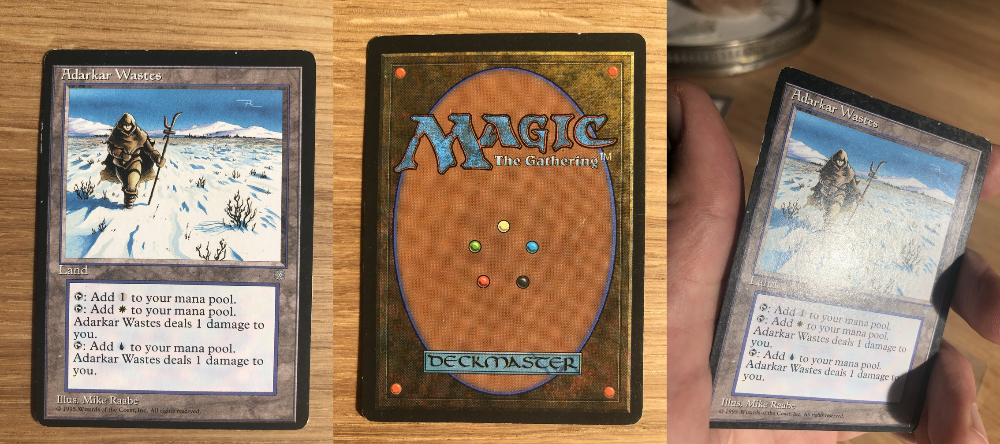

# mtg_powertools
Scripts to help selling MtG cards online.

Uses  to remove geotags from the smartphone pictures.
Uses Exiftool and Imagemagick to batch remove geotags, resize, reorient and stitch together smartphone photos that are grouped per card into separate folders.

Use case is the constraint imposed by Cardmarket of only allowing a single JPG file for each card put on offer on their website.

Produces this output from three separate photos:

# Software versions

Tested on Ubuntu 18.04LTS, with `ImageMagick 6.9.7-4 Q16 x86_64 20170114` and `exiftool 10.80`.

